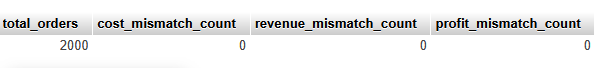
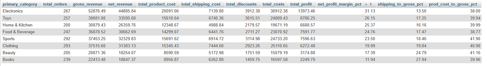
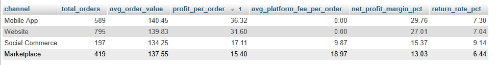
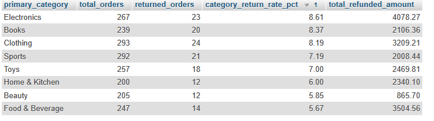
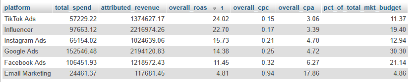
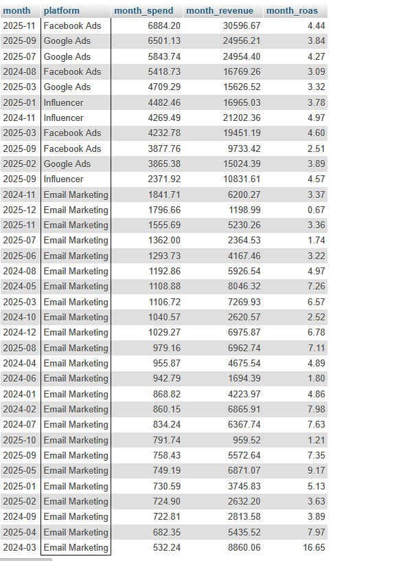

# BrightCart E-Commerce Profitability Analysis (MySQL Guide)

This guide provides a complete, step-by-step walkthrough of BrightCart's profitability analysis using MySQL. It connects order-level transaction data, product cost structures, and channel-level marketing spend to uncover true net profit margins and pinpoint exact areas of margin erosion.

---

## 📋 Table of Contents
1. [Data Model Overview](#1-data-model-overview)
2. [Step 1: Data Preparation & Base Views](#step-1-data-preparation--base-views)
3. [Step 2: Item-Level Gross Margin Analysis](#step-2-item-level-gross-margin-analysis)
4. [Step 3: Order-Level Net Profitability & Shipping Erosion](#step-3-order-level-net-profitability--shipping-erosion)
5. [Step 4: Marketing Attribution & Blended CAC](#step-4-marketing-attribution--blended-cac)
6. [Step 5: Executive Profitability Summary & Erosion Diagnosis](#step-5-executive-profitability-summary--erosion-diagnosis)
7. [Key Business Takeaways](#key-business-takeaways)

---

## Data Model Overview

The analysis relies on five core tables in the MySQL database:

| Table | Description |
| :--- | :--- |
| `orders` | Transaction details (`order_id`, `customer_id`, `order_date`, `shipping_cost_charged`, `shipping_cost_actual`) |
| `products` | Product catalog & costs (`product_id`, `category`, `product_name`, `cogs`) |
| `marketing_spend` | Ad spend tracking (`campaign_id`, `channel`, `spend_date`, `spend_amount`) |


---

## 1: Database & Schema Setup
Execute the DDL below to set up tables in MySQL and import the datasets.

```sql
CREATE DATABASE IF NOT EXISTS brightcart_db;
USE brightcart_db;

-- 1. Orders Table DDL
CREATE TABLE IF NOT EXISTS orders (
    order_id VARCHAR(20) PRIMARY KEY,
    customer_id VARCHAR(20),
    order_date DATE,
    channel VARCHAR(50),
    payment_method VARCHAR(50),
    region VARCHAR(50),
    items_ordered INT,
    primary_category VARCHAR(50),
    gross_revenue DECIMAL(10,2),
    discount_pct INT,
    discount_amount DECIMAL(10,2),
    shipping_cost DECIMAL(10,2),
    product_cost DECIMAL(10,2),
    platform_fee DECIMAL(10,2),
    transaction_fee DECIMAL(10,2),
    returned VARCHAR(5),
    refund_amount DECIMAL(10,2),
    net_revenue DECIMAL(10,2),
    total_costs DECIMAL(10,2),
    profit DECIMAL(10,2)
);

-- 2. Products Table DDL
CREATE TABLE IF NOT EXISTS products (
    product_id VARCHAR(20) PRIMARY KEY,
    product_name VARCHAR(100),
    category VARCHAR(50),
    sub_category VARCHAR(50),
    unit_cost DECIMAL(10,2),
    selling_price DECIMAL(10,2),
    shipping_cost_per_unit DECIMAL(10,2),
    weight_lbs DECIMAL(8,2),
    supplier VARCHAR(100)
);

-- 3. Marketing Spend Table DDL
CREATE TABLE IF NOT EXISTS marketing_spend (
    month VARCHAR(7),
    platform VARCHAR(50),
    spend DECIMAL(10,2),
    impressions INT,
    clicks INT,
    conversions INT,
    revenue_attributed DECIMAL(10,2),
    cpc DECIMAL(10,2),
    cpa DECIMAL(10,2),
    roas DECIMAL(10,2)
);


```

## Step 1: Data Integrity & Verification
Before running aggregations, verify that cost, revenue, and profit metrics align with standard \ formula logic across all order rows:

**Total Costs** = Product Cost + Shipping Cost + Platform Fee + Transaction Fee

**Net Revenue** = Gross Revenue - Discount Amount - Refund Amount

**Profit** = Net Revenue - Total Costs

```sql
SELECT 
    COUNT(*) AS total_orders,
    SUM(CASE WHEN ABS(total_costs - (product_cost + shipping_cost + platform_fee + transaction_fee)) > 0.01 THEN 1 ELSE 0 END) AS cost_mismatch_count,
    SUM(CASE WHEN ABS(net_revenue - (gross_revenue - discount_amount - refund_amount)) > 0.01 THEN 1 ELSE 0 END) AS revenue_mismatch_count,
    SUM(CASE WHEN ABS(profit - (net_revenue - total_costs)) > 0.01 THEN 1 ELSE 0 END) AS profit_mismatch_count
FROM orders;
---

```
Data Health Summary: All 2,000 order records passed verification with 0 calculation mismatches, confirming high financial data reliability.\


## Step 2: Product Category Profitability Analysis

This query aggregates revenue, costs, and profit by primary product category to evaluate net profit margins and identify primary profit drivers.\


```sql
SELECT 
    primary_category,
    COUNT(order_id) AS total_orders,
    ROUND(SUM(gross_revenue), 2) AS gross_revenue,
    ROUND(SUM(net_revenue), 2) AS net_revenue,
    ROUND(SUM(product_cost), 2) AS total_product_cost,
    ROUND(SUM(shipping_cost), 2) AS total_shipping_cost,
    ROUND(SUM(discount_amount), 2) AS total_discounts,
    ROUND(SUM(total_costs), 2) AS total_costs,
    ROUND(SUM(profit), 2) AS total_profit,
    ROUND((SUM(profit) / SUM(net_revenue)) * 100, 2) AS net_profit_margin_pct,
    ROUND((SUM(shipping_cost) / SUM(gross_revenue)) * 100, 2) AS shipping_to_gross_pct,
    ROUND((SUM(product_cost) / SUM(gross_revenue)) * 100, 2) AS prod_cost_to_gross_pct
FROM orders
GROUP BY primary_category
ORDER BY net_profit_margin_pct DESC;
```


* **Most Profitable: Electronics (31.13% Net Margin)** leads with $13,973.46 in net profit, supported by a higher average item order size and a low shipping-to-gross ratio (**13.50%**).

* **Least Profitable: Books (11.94%)** and **Beauty (17.39%)** yield the lowest margins. The primary driver is **shipping cost overhead relative to selling price** (**27.94%** of gross revenue for Books and **24.79%** for Beauty).

## Step 3: Sales Channel Profitability Analysis

This query compares average order value (AOV), profit per order, return rates, and platform fee drag across sales channels.

```sql
SELECT 
    channel,
    COUNT(order_id) AS total_orders,
    ROUND(AVG(gross_revenue), 2) AS avg_order_value,
    ROUND(SUM(profit) / COUNT(order_id), 2) AS profit_per_order,
    ROUND(AVG(platform_fee), 2) AS avg_platform_fee_per_order,
    ROUND((SUM(profit) / SUM(net_revenue)) * 100, 2) AS net_profit_margin_pct,
    ROUND((SUM(CASE WHEN returned = 'Yes' THEN 1 ELSE 0 END) / COUNT(order_id)) * 100, 2) AS return_rate_pct
FROM orders
GROUP BY channel
ORDER BY profit_per_order DESC;
```


* **Direct Channels Rule Profitability: Mobile App** ($36.32/order) and **Website** ($31.60/order) generate more than double the profit per order compared to third-party channels.

* **Platform Fee Impact: Marketplace** charges an average platform fee of **$18.97 per order,** cutting net margin down to **13.03%.** **Social Commerce** charges **$9.87 per order,** dropping margin to **15.37%.**

## Step 4: Return Rate & Lost Revenue Analysis

This query compares average order value (AOV), profit per order, return rates, and platform fee drag across sales channels.

```sql 
SELECT 
    primary_category,
    COUNT(order_id) AS total_orders,
    SUM(CASE WHEN returned = 'Yes' THEN 1 ELSE 0 END) AS returned_orders,
    ROUND((SUM(CASE WHEN returned = 'Yes' THEN 1 ELSE 0 END) / COUNT(order_id)) * 100, 2) AS category_return_rate_pct,
    ROUND(SUM(refund_amount), 2) AS total_refunded_amount
FROM orders
GROUP BY primary_category
ORDER BY category_return_rate_pct DESC;
```


* **Overall Return Impact:** 144 out of 2,000 orders were returned (**7.20% overall return rate**), resulting in **$20,582.45** in direct top-line revenue leakage.

* **Highest Risk Categories: Electronics (8.61%)** and **Books (8.37%)** experience the highest return rates. In Electronics, returns directly erode $4,078.27 in revenue due to higher average price points.


## Step 5: Marketing Spend, CPC, CPA & ROAS Analysis

This query measures overall performance across advertising channels over the entire 24-month dataset.

```sql
SELECT 
    platform,
    ROUND(SUM(spend), 2) AS total_spend,
    ROUND(SUM(revenue_attributed), 2) AS attributed_revenue,
    ROUND(SUM(revenue_attributed) / SUM(spend), 2) AS overall_roas,
    ROUND(SUM(spend) / SUM(clicks), 2) AS overall_cpc,
    ROUND(SUM(spend) / SUM(conversions), 2) AS overall_cpa,
    ROUND((SUM(spend) / (SELECT SUM(spend) FROM marketing_spend)) * 100, 2) AS pct_of_total_mkt_budget
FROM marketing_spend
GROUP BY platform
ORDER BY overall_roas DESC;
```



### Underperforming Platforms
1. **Email Marketing:** Delivers an inefficient **4.81 ROAS,** with a high **$17.86 CPA** and **$0.94 CPC.**

2. **Facebook Ads:** Takes up 21.14% of the total budget ($106.45k) but yields the lowest ROAS (**11.45**) among major paid ad channels, with a **$6.27 CPA.**


## Step 6: Executive Recommendations (20% Budget Cut Target)
* **Total 2-Year Marketing Budget:** $503,506.14
* **20% Reduction Target:** $100,701.23

To achieve this target while preserving customer acquisition efficiency, use the following execution plan:
```sql
-- Query to identify specific underperforming platform months (ROAS < 5.0)
SELECT 
    month,
    platform,
    ROUND(spend, 2) AS month_spend,
    ROUND(revenue_attributed, 2) AS month_revenue,
    ROUND(roas, 2) AS month_roas
FROM marketing_spend
WHERE roas < 5.0 OR platform = 'Email Marketing'
ORDER BY spend DESC;

```


## Executive Summary & Top 3 Recommendations

### Recommendation 1: Re-architect Email Marketing & Cut Active Paid Email Campaigns

* **Action:** Fully trim or restructure paid outbound email acquisition channels.

* **Data Support:** Email marketing absorbed **$24,461.37** while generating a low **4.81 ROAS** and an unviable **$17.86 CPA.** Transition email retention to automated internal workflows.

* **Cost Savings: $24,461.37** (100% of Email channel budget).

### Recommendation 2: Reduce Facebook Ads Budget by 50% & Reallocate to TikTok / Influencer

* **Action:** Reduce Facebook paid advertising budget by half.

* **Data Support:** Facebook Ads consumed **$106,451.93** (21.1% of marketing budget) at a **11.45 ROAS** and **$6.27 CPA**—half as effective as TikTok (**24.02 ROAS, $3.06 CPA**) and Influencers (22.70 ROAS, $3.39 CPA).

* **Cost Savings:** $53,225.97.

### Recommendation 3: Eliminate Off-Peak Ad Spend on Google Ads

* **Action:** Cut Google Ads spend during historically weak ROAS months (< 5.0 ROAS), specifically during off-peak periods in February, March, July, and September.

* **Data Support:** In these four low-converting months across 2024 and 2025, Google Ads consumed **$23,013.89** with an unprofitably low ROAS (averaging under 3.8).

* **Cost Savings:** $23,013.89.


### Total Financial Impact Summary

$$ \text{Total Savings} = \$24,461.37 + \$53,225.97 + \$23,013.89 = \mathbf{\$100,701.23} $$

> **Conclusion:** *By executing these three targeted adjustments, BrightCart satisfies the **20% ($100,701.23) marketing spend reduction target** while re-allocating volume toward high-performing channels like TikTok, Influencers, and direct proprietary channels (Mobile App & Website).*